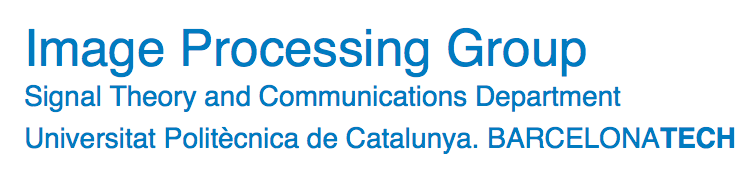
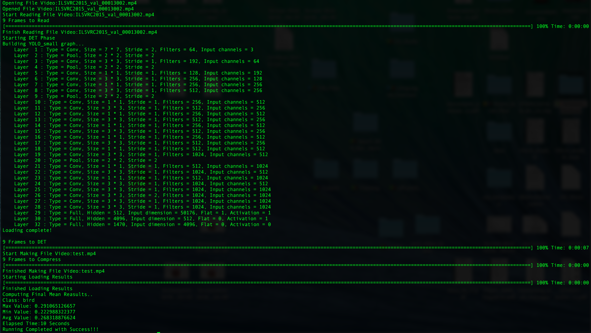
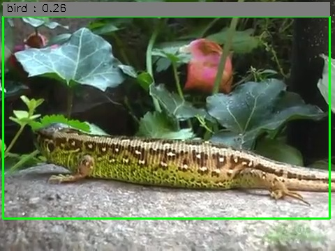

# Tensorflow_Object_Tracking_Video

(Version 0.1, Last Update 25-06-2016)




The Project  follow the below **index**:

1. **[Introduction](https://github.com/DrewNF/Tensorflow_Object_Tracking_Video#1introduction);**
2. **[Requitements & Installation](https://github.com/DrewNF/Tensorflow_Object_Tracking_Video#2requirement--installation);**
3. **[YOLO Script Usage](https://github.com/DrewNF/Tensorflow_Object_Tracking_Video#3yolo-script-usage)**
      1. **[Setting Parameters](https://github.com/DrewNF/Tensorflow_Object_Tracking_Video#isetting-parameters);**
      2. **[Usage](https://github.com/DrewNF/Tensorflow_Object_Tracking_Video#iiusage).**
4. **[TENSORBOX SINGLE_CLASS Script Usage](https://github.com/DrewNF/Tensorflow_Object_Tracking_Video#4tensorbox-single_class-script-usage)**
      1. **[Setting Parameters](https://github.com/DrewNF/Tensorflow_Object_Tracking_Video#isetting-parameters-1);**
      2. **[Usage](https://github.com/DrewNF/Tensorflow_Object_Tracking_Video#iiusage-1).**
5. **[Copyright](https://github.com/DrewNF/Tensorflow_Object_Tracking_Video#5copyright);**
6.  **[State of the Project](https://github.com/DrewNF/Tensorflow_Object_Tracking_Video#6state-of-the-project).**


## 1.Introduction

This Repository is my Master Thesis Project: "Develop a Video Object Tracking with Tensorflow Technology" 
and it's still developing, so many updates will be made.
In this work, I used the architecture and problem solving strategy of the Paper T-CNN([Arxiv](http://arxiv.org/abs/1604.02532)), that won last year [IMAGENET 2015](http://image-net.org/) [Teaser Challenge VID](http://image-net.org/challenges/LSVRC/2015/results).
So the whole script architecture will be made of several component in cascade:
  1. Still Image Detection (Return Tracking Results on single Frame);
  2. Temporal Information Detection( Introducing Temporal Information into the DET Results);
  3. Context Information Detection( Introducing Context Information into the DET Results);

> Notice that the Still Image Detection component could be unique or decompose into two sub-component:
>  1. First: determinate "Where" in the Frame;
>  2. Second: determinate "What" in the Frame.


My project use many online tensorflow projects, as: 
  - [YOLO Tensorflow](https://github.com/gliese581gg/YOLO_tensorflow);
  - [TensorBox](https://github.com/Russell91/TensorBox).

## 2.Requirement & Installation
To install the script you only need to download the Repository.
To Run the script you have to had installed:
  - Tensorflow;
  - OpenCV;
  - Python;

All the Python library necessary could be installed easily trought pip install package-name.
If you want to follow a guide to install the requirements here is the link for a [tutorial](https://github.com/DrewNF/Build-Deep-Learning-Env-with-Tensorflow-Python-OpenCV) I wrote for myself.

## 3.YOLO Script Usage
### i.Setting Parameters
  Into the script file, at the start, you will found this paragraph:
        
  ```python      
    folder_path_det_frames='det_frames/'
    folder_path_det_result='det_reults/'
    folder_path_summary_result='summary_result/'
    file_name_summary_result='results.txt'
    file_path_summary_result=folder_path_summary_result+'results.txt'
    path_video='input_video.mp4'
    path_video_out='output_video.mp4'
    video_perc=100
  ```
  
  Leave them as set, if you want to only try a run, otherwise you can change them to test on your own data.
  
  Now you have to download the [weights](https://drive.google.com/file/d/0B2JbaJSrWLpza08yS2FSUnV2dlE/view?usp=sharing ) for YOLO and put them into /YOLO_DET_Alg/weights/.
  
  For YOLO knowledge [here](http://pjreddie.com/darknet/yolo/) you can find Original code(C implementation) & paper.
  
### ii.Usage
  After Set the Parameters, we can proceed and run the script:
  
  ```python
    python tensorflow_video.py
  ```
You will see some Terminal Output like:



You will see a realtime frames output(like the one here below) and then finally all will be embedded into the Video Output( I uploaded the first two Test I've made in the folder /video_result, you can download them and take a look to the final result.
The first one has problems in the frames order, this is why you will see so much flickering in the video image,the problem was then solved and in the second doesn't show frames flickering ):



## 4.TENSORBOX SINGLE_CLASS Script Usage
### i.Setting Parameters
  
### ii.Usage

## 5.Copyright

According to the LICENSE file of the original code,

  - Me and original author hold no liability for any damages;
  - Do not use this on commercial!.

## 6.State of the Project

  - Support only YOLO DET Algorithm;
  - Not support Training;
  - Not use of Temporal & Context Information;
  - Working on adapt TensorBox and GoogleNet in Cascade,to support Training and achive better accuracy;
